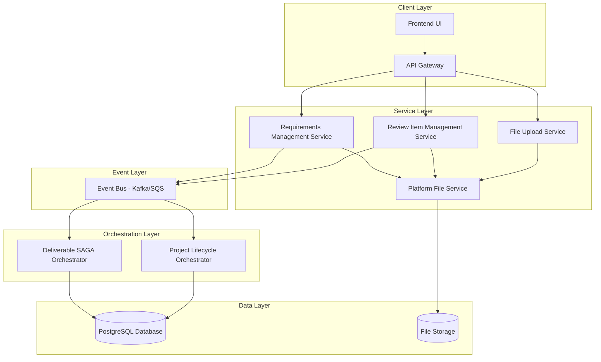
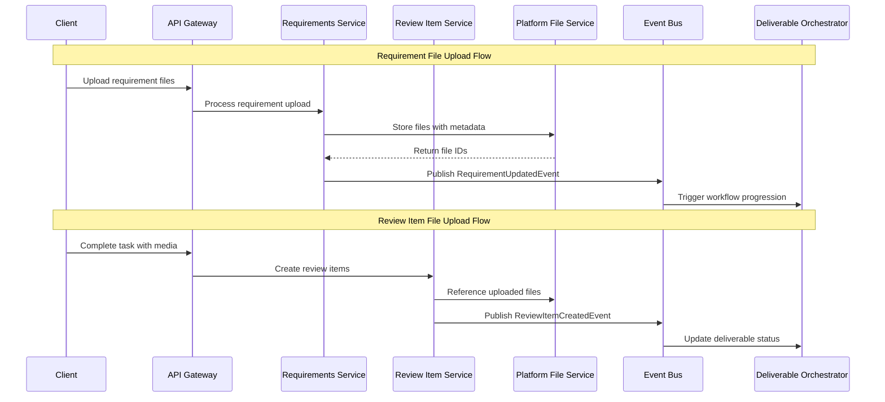

# Design Document

## Overview

This design document outlines the comprehensive integration between file upload services, requirements management, and review item management to create a seamless workflow for handling both requirement files (client inputs) and review item files (team outputs) with proper automation and testing capabilities.

## Architecture

### High-Level Architecture



### Service Integration Flow



## Components and Interfaces

### 1. File Upload Integration Service

**Purpose**: Centralized service for handling file uploads across different contexts

**Key Methods**:
```python
class FileUploadIntegrationService:
    async def upload_requirement_files(
        self, 
        requirement_id: UUID, 
        files: List[UploadFile],
        metadata: RequirementFileMetadata
    ) -> List[UUID]
    
    async def upload_review_item_files(
        self, 
        task_id: UUID, 
        files: List[UploadFile],
        metadata: ReviewItemFileMetadata
    ) -> List[UUID]
    
    async def validate_file_types(
        self, 
        files: List[UploadFile], 
        context: FileUploadContext
    ) -> ValidationResult
```

### 2. Enhanced Requirements Management Service

**Purpose**: Handle requirement file uploads with proper validation and storage

**Key Methods**:
```python
class RequirementsManagementService:
    async def upload_requirement_files(
        self,
        requirement_id: UUID,
        files: List[UploadFile],
        user_context: AuthContext
    ) -> List[RequirementFile]
    
    async def update_requirement_status(
        self,
        requirement_id: UUID,
        status: RequirementStatus,
        file_ids: Optional[List[UUID]] = None
    ) -> Requirement
```

### 3. Enhanced Review Item Management Service

**Purpose**: Handle review item creation and file association

**Key Methods**:
```python
class ReviewItemManagementService:
    async def create_review_items_from_task_completion(
        self,
        task_id: UUID,
        platform_file_ids: List[UUID],
        review_item_type: ReviewItemType
    ) -> List[ReviewItem]
    
    async def submit_review_feedback(
        self,
        review_item_id: UUID,
        feedback: ReviewFeedback,
        user_context: AuthContext
    ) -> ReviewFeedbackResult
```

### 4. File Version Management Service

**Purpose**: Handle file versioning and history tracking

**Key Methods**:
```python
class FileVersionService:
    async def create_file_version(
        self,
        original_file_id: UUID,
        new_file_id: UUID,
        version_type: VersionType
    ) -> FileVersion
    
    async def get_file_history(
        self,
        file_id: UUID
    ) -> List[FileVersion]
    
    async def mark_file_as_final(
        self,
        file_id: UUID
    ) -> FileVersion
```

## Data Models

### Enhanced File Reference Models

```python
class RequirementFile(Base):
    __tablename__ = "requirement_files"
    
    id = Column(UUID, primary_key=True)
    requirement_id = Column(UUID, ForeignKey("requirements.id"))
    platform_file_id = Column(UUID, nullable=False)  # Reference to platform-service
    file_name = Column(String(255))
    file_type = Column(String(50))
    file_size = Column(Integer)
    upload_timestamp = Column(DateTime)
    uploaded_by = Column(UUID)  # User ID
    is_active = Column(Boolean, default=True)
    
class ReviewItemFile(Base):
    __tablename__ = "review_item_files"
    
    id = Column(UUID, primary_key=True)
    review_item_id = Column(UUID, ForeignKey("review_items.id"))
    platform_file_id = Column(UUID, nullable=False)
    file_name = Column(String(255))
    file_type = Column(String(50))
    sequence_order = Column(Integer)  # Order within review item
    created_at = Column(DateTime)
    
class FileVersion(Base):
    __tablename__ = "file_versions"
    
    id = Column(UUID, primary_key=True)
    original_file_id = Column(UUID)  # Reference to original platform file
    current_file_id = Column(UUID)   # Reference to current version
    version_number = Column(Integer)
    version_type = Column(Enum(VersionType))  # INITIAL, REVISION, FINAL
    created_at = Column(DateTime)
    created_by = Column(UUID)
    is_final = Column(Boolean, default=False)
```

### Enhanced Review Feedback Model

```python
class ReviewFeedback(Base):
    __tablename__ = "review_feedback"
    
    id = Column(UUID, primary_key=True)
    review_item_id = Column(UUID, ForeignKey("review_items.id"))
    feedback_type = Column(Enum(FeedbackType))  # APPROVE, REJECT, COMMENT
    comment_text = Column(Text)
    timestamp_seconds = Column(Integer)  # For video/audio feedback
    coordinates = Column(JSONB)  # For image annotation
    submitted_by = Column(UUID)
    submitted_at = Column(DateTime)
    
    # Relationship to generated tasks
    generated_task_id = Column(UUID, ForeignKey("internal_tasks.id"), nullable=True)
```

## Error Handling

### File Upload Error Handling

```python
class FileUploadError(Exception):
    def __init__(self, service: str, error_type: str, details: dict):
        self.service = service
        self.error_type = error_type
        self.details = details

class FileUploadErrorHandler:
    async def handle_requirement_upload_error(
        self, 
        error: FileUploadError, 
        requirement_id: UUID
    ) -> ErrorResponse
    
    async def handle_review_item_upload_error(
        self, 
        error: FileUploadError, 
        task_id: UUID
    ) -> ErrorResponse
    
    async def retry_failed_upload(
        self, 
        upload_id: UUID, 
        max_retries: int = 3
    ) -> RetryResult
```

### Error Recovery Strategies

1. **Requirement File Upload Failures**:
   - Retry mechanism with exponential backoff
   - Partial upload recovery (resume from last successful chunk)
   - Fallback to alternative storage if platform-service unavailable

2. **Review Item Creation Failures**:
   - Queue failed review item creations for retry
   - Maintain task completion status even if review creation fails
   - Manual review item creation interface for recovery

## Testing Strategy

### Unit Testing

```python
class TestFileUploadIntegration:
    async def test_requirement_file_upload_success(self):
        # Test successful requirement file upload
        pass
    
    async def test_review_item_file_upload_success(self):
        # Test successful review item file upload
        pass
    
    async def test_file_upload_validation_errors(self):
        # Test file type and size validation
        pass
    
    async def test_service_integration_errors(self):
        # Test error handling between services
        pass

class TestReviewWorkflow:
    async def test_complete_review_approval_flow(self):
        # Test end-to-end review approval
        pass
    
    async def test_review_rejection_and_rework(self):
        # Test rejection and automatic rework task creation
        pass
    
    async def test_file_versioning_workflow(self):
        # Test file version management
        pass
```

### Integration Testing

```python
class TestServiceIntegration:
    async def test_requirements_to_review_workflow(self):
        # Test complete flow from requirement upload to review
        pass
    
    async def test_cross_service_error_handling(self):
        # Test error propagation between services
        pass
    
    async def test_event_driven_workflow(self):
        # Test SAGA orchestration with file uploads
        pass
```

### Automated Postman Testing

**Test Collection Structure**:
```json
{
  "collection_name": "File Upload Review Integration Tests",
  "folders": [
    {
      "name": "Requirement File Upload Tests",
      "tests": [
        "Upload single requirement file",
        "Upload multiple requirement files",
        "Upload with invalid file types",
        "Upload with oversized files"
      ]
    },
    {
      "name": "Review Item File Upload Tests",
      "tests": [
        "Complete task with single file",
        "Complete task with multiple files",
        "Create review items automatically",
        "Handle file upload failures"
      ]
    },
    {
      "name": "Review Workflow Tests",
      "tests": [
        "Submit approval feedback",
        "Submit rejection with comments",
        "Verify automatic task creation",
        "Test file versioning"
      ]
    },
    {
      "name": "End-to-End Workflow Tests",
      "tests": [
        "Complete project lifecycle with files",
        "Multi-deliverable file management",
        "Pricing integration with file uploads",
        "Timeline updates with review delays"
      ]
    }
  ]
}
```

**Automated Test Scripts**:
```javascript
// Pre-request script for authentication
pm.globals.set("auth_token", pm.environment.get("test_auth_token"));

// Test script for file upload validation
pm.test("File upload successful", function () {
    pm.response.to.have.status(201);
    const response = pm.response.json();
    pm.expect(response.platform_file_ids).to.be.an('array');
    pm.expect(response.platform_file_ids.length).to.be.greaterThan(0);
});

// Test script for review item creation
pm.test("Review items created automatically", function () {
    pm.response.to.have.status(200);
    const response = pm.response.json();
    pm.expect(response.review_items_created).to.equal(true);
    pm.expect(response.review_item_count).to.be.greaterThan(0);
});
```

## Performance Considerations

### File Upload Optimization

1. **Chunked Upload Support**: Large files uploaded in chunks to prevent timeouts
2. **Parallel Processing**: Multiple files uploaded concurrently
3. **Compression**: Automatic file compression for supported formats
4. **CDN Integration**: Files served through CDN for faster access

### Database Optimization

1. **Indexing Strategy**:
   - Index on `platform_file_id` for fast file lookups
   - Composite index on `(requirement_id, file_type)` for requirement files
   - Index on `(review_item_id, sequence_order)` for review item files

2. **Query Optimization**:
   - Use eager loading for file relationships
   - Implement pagination for file listings
   - Cache frequently accessed file metadata

### Event Processing Optimization

1. **Batch Processing**: Group related file events for batch processing
2. **Event Deduplication**: Prevent duplicate processing of file events
3. **Circuit Breaker**: Implement circuit breaker for external service calls

## Security Considerations

### File Security

1. **File Type Validation**: Strict validation of uploaded file types
2. **Virus Scanning**: Integration with antivirus scanning service
3. **Access Control**: Role-based access to uploaded files
4. **Encryption**: Files encrypted at rest and in transit

### API Security

1. **Authentication**: JWT-based authentication for all file operations
2. **Authorization**: Business-level isolation for file access
3. **Rate Limiting**: Prevent abuse of file upload endpoints
4. **Audit Logging**: Comprehensive logging of all file operations

## Monitoring and Observability

### Metrics to Track

1. **File Upload Metrics**:
   - Upload success/failure rates
   - Average upload time by file size
   - Storage utilization by project/deliverable

2. **Review Process Metrics**:
   - Review item creation success rate
   - Average review completion time
   - Rework task generation frequency

3. **Integration Health Metrics**:
   - Service-to-service call success rates
   - Event processing latency
   - Error recovery success rates

### Alerting Strategy

1. **Critical Alerts**:
   - File upload service unavailable
   - High error rates in review item creation
   - Platform-service integration failures

2. **Warning Alerts**:
   - Slow file upload performance
   - High rework task generation
   - Storage quota approaching limits